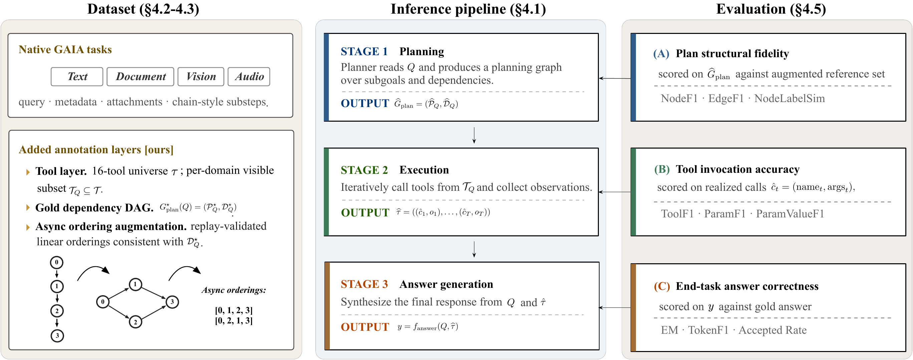

# Beyond Sequential Plans

This repository contains the code and data plumbing for a three-facet evaluation
of tool-augmented LLM agents. The core idea is simple: final-answer accuracy is
not enough. A run can fail because the model planned the task poorly, selected
or grounded the wrong tools, or synthesized the final answer incorrectly after a
mostly valid trace. The framework therefore evaluates these facets separately on
the same task record:

1. **Plan structural fidelity**: does the predicted planning graph recover the
   required planning intents and dependency edges?
2. **Tool invocation accuracy**: does the realized tool trace select the right
   tool families, argument slots, and grounded values?
3. **End-task answer correctness**: does the submitted final answer match the
   task target?

The main benchmark instantiation is **Augmented GAIA**. It is rebuilt locally
from the official gated GAIA dataset plus our annotation sidecar. The public
repository does not redistribute GAIA questions, final answers, or attachments.



## What Is In This Repository

- `src/inference/`: staged planner, API/local backends, tool execution, parsing,
  attachment handling, and provider routing.
- `src/evaluation/`: planning, tool-use, execution, and answer metrics.
- `scripts/exp.sh`: main experiment entrypoint for GAIA, TaskBench, and UltraTool.
- `scripts/prepare_gaia_from_official.py`: rebuilds local Augmented GAIA from
  an official GAIA snapshot and a controlled annotation bundle.
- `scripts/export_gaia_annotations.py`: exports a controlled annotation bundle
  from a local Augmented GAIA working tree without top-level GAIA questions or
  final answers.
- `scripts/fetch_official_sources.py`: optional helper for downloading or
  cloning official upstream benchmark sources into an untracked local folder.
- `scripts/prepare_crossbench.py`: materializes the TaskBench and UltraTool
  cross-benchmark files used by the paper, either from unified artifacts or
  from the official raw layouts.
- `annotations/`: documentation for controlled annotation artifacts. The actual
  annotation bundle is not tracked by Git.
- `data/`: local generated data root used by scripts. This directory is ignored
  and is not tracked.
- `results/`: released result artifacts used to audit the paper numbers,
  limited to aggregate tables, figures, and non-raw summaries. Paper source
  files are intentionally not tracked in this repository.

## Dataset Artifact

The anonymized NeurIPS evaluation-dataset artifact is hosted on Hugging Face:

- Dataset artifact:
  <https://huggingface.co/datasets/anonymousllmplanning/augmented-gaia-planning>
- Croissant metadata:
  <https://huggingface.co/datasets/anonymousllmplanning/augmented-gaia-planning/resolve/main/croissant.json>

The artifact contains controlled Augmented GAIA annotations, Croissant metadata,
a package manifest, rebuild scripts, checksums, and sanitized aggregate result
summaries. It does **not** contain GAIA raw validation/test questions, final
answers, or attachments. To reconstruct the full local evaluation layout, first
obtain GAIA from the official gated Hugging Face dataset
(`gaia-benchmark/GAIA`) after accepting its access conditions, then combine that
official source with the released annotation bundle using the scripts below.

To download the artifact locally:

```bash
python - <<'PY'
from huggingface_hub import snapshot_download

snapshot_download(
    repo_id="anonymousllmplanning/augmented-gaia-planning",
    repo_type="dataset",
    local_dir="release/neurips2026_ed_dataset",
)
PY
```

After downloading, extract the controlled annotation archive before running the
GAIA preparation step:

```bash
mkdir -p annotations/gaia_annotations
unzip -q release/neurips2026_ed_dataset/annotations/gaia_annotations.zip \
  -d annotations/gaia_annotations
```

## Augmented GAIA Data Layout

After rebuilding from the official GAIA snapshot, the canonical local GAIA root
is:

```text
data/Augmented/
  cat_A_text/
  cat_B_document/
  cat_C_vision/
  cat_D_audio/
  DAGs/                  # Gemma 4 replay-filtered scoring view
  Asynchronous_output/
  build_manifest.json
  checksums.sha256
```

The categorized splits contain the task records and attachments used for
inference. `Asynchronous_output/` stores the unfiltered GPT-4o dependency DAG
annotations and candidate dependency-preserving async orderings. It contains
1,771 non-native candidate orderings. `DAGs/` stores the final Gemma 4
replay-filtered scoring view: the 165 native chain references plus 1,357
behavior-preserving non-native async orderings. The controlled annotation bundle
may call this source view `Gemma4_Filtered_DAGs/`; the local rebuilt data root
uses only `DAGs/` so that `scripts/exp.sh` has one canonical reference path.

The paper accounting for the final release is:

- 165 original GAIA tasks.
- 1,284 planning nodes and 1,086 reduced dependency edges.
- 1,771 candidate non-native async orderings.
- 1,357 Gemma 4 behavior-preserving retained non-native async orderings.
- 1,522 final reference ordering rows after adding the 165 native chains.
- 58 tasks with at least one retained async ordering beyond the native chain.
- 54 multi-order-rich tasks with at least two retained async orderings.

## Metrics

### Plan Structural Fidelity

Planning is evaluated on the model's Stage-1 abstract planning-intent DAG.
`NodeF1` uses sentence-transformer semantic node alignment. `EdgeF1` measures
direct dependency recovery after node alignment. The headline planning score is:

```text
PlanningScore = 0.5 * NodeF1 + 0.5 * EdgeF1
```

Native GAIA scores against the original serialized chain. Augmented GAIA scores
against the native chain plus the replay-filtered dependency-aware reference
set, taking the best valid reference score. Node inventory is unchanged by
augmentation; the main augmentation effect appears in EdgeF1.

### Tool Invocation Accuracy

Tool usage is evaluated from realized non-submit tool calls:

```text
ToolUsageScore = (ToolF1 + ParamF1 + ParamValueF1) / 3
```

`ParamF1` is computed in the shared evaluation framework for every model
family. Predicted optional execution-control arguments such as `engine`,
`max_results`, `action`, `page`, and `language` are ignored only when the gold
tool slot for that tool does not require them. If a gold slot explicitly
requires one of these arguments, it remains part of ParamF1. This avoids
provider- or adapter-specific defaults changing the score while keeping genuine
schema errors penalized.

For GAIA, `ParamValueF1` uses execution-normalized stable value matching. It
credits equivalent file/path aliases, typed file-reader realizations, shared
image/audio file resources, URL normalizations, numeric calculator equivalence,
and query-like string overlap. Strict value matching is retained as an audit
diagnostic, but the headline tool score uses the normalized value component.

### End-Task Answer Correctness

Answer evaluation reports strict Exact Match, TokenF1, raw correctness rate, and
Accepted Answer rate. Accepted Answer is the headline final-answer metric in the
paper and accounts for surface-form variants accepted during answer review.

## Installation

Use Python 3.10 or newer. A minimal setup is:

```bash
python -m venv .venv
source .venv/bin/activate
pip install -r requirements.txt
```

Some tools benefit from optional system packages such as `poppler-utils`,
`ffmpeg`, `tesseract-ocr`, and `graphviz`. For JS-rendered web pages, also run
`playwright install chromium` after installing the Python requirements.

## Prepare Data

The framework expects generated local data under `data/`, but this repository
does not track that folder.

### GAIA

GAIA must be obtained from the official gated Hugging Face dataset
(`gaia-benchmark/GAIA`) after accepting its access conditions. The GAIA dataset
card asks users not to reshare validation or test data in a crawlable format, so
this repository only provides the rebuild scripts.

If you already have an official GAIA snapshot:

```bash
python scripts/prepare_gaia_from_official.py \
  --gaia-source /path/to/official/GAIA \
  --annotation-root /path/to/controlled/gaia_annotations \
  --output-root data/Augmented \
  --overwrite
```

You can also fetch the official gated snapshot with Hugging Face credentials:

```bash
HF_TOKEN="<YOUR_HF_TOKEN>" \
python scripts/fetch_official_sources.py \
  --dataset gaia \
  --output-root raw_sources

python scripts/prepare_gaia_from_official.py \
  --gaia-source raw_sources/gaia \
  --annotation-root /path/to/controlled/gaia_annotations \
  --output-root data/Augmented \
  --overwrite
```

If you need to export the controlled annotation bundle from a local working copy
owned by the authors:

```bash
python scripts/export_gaia_annotations.py \
  --source-root data/Augmented \
  --output-root /path/to/controlled/gaia_annotations \
  --overwrite
```

The annotation bundle strips top-level GAIA questions and final answers, but its
planning step labels and tool annotations may still reveal task-specific
solution structure. Treat it as a controlled artifact rather than a crawlable
public dataset.

By default, `scripts/exp.sh` uses `data/Augmented`. Override with:

```bash
export GAIA_DATA_ROOT=/path/to/Augmented
```

### TaskBench and UltraTool

The public repo also does not track TaskBench or UltraTool generated files. To
fetch upstream sources into an ignored local directory:

```bash
python scripts/fetch_official_sources.py \
  --dataset taskbench \
  --dataset ultratool \
  --output-root raw_sources
```

To materialize the exact cross-benchmark files used by the paper from an
existing controlled source or the raw upstream layouts:

```bash
python scripts/prepare_crossbench.py \
  --source-root /path/to/crossbench_source \
  --output-root data
```

For the raw upstream layout, `/path/to/crossbench_source` can be the parent
folder containing `microsoft/Taskbench` files and the cloned UltraTool
repository. The script searches for TaskBench folders containing
`data.json`, `graph_desc.json`, `user_requests.jsonl`, and `tool_desc.json`, and
for the UltraTool English `test_set` folder containing `test.json` and
`tool_usage*.json` files.

If only one auxiliary upstream source is being prepared, use `--only`:

```bash
python scripts/prepare_crossbench.py \
  --source-root /path/to/official/Taskbench \
  --output-root data \
  --only taskbench
```

This creates:

```text
data/Taskbench/unified_taskbench_order_chain500_dag500.jsonl
data/Ultratool/unified_ultratool_en_1000.jsonl
data/crossbench_manifest.json
```

## Running Experiments

The main entrypoint is:

```bash
bash scripts/exp.sh --help
```

Two modes are used most often:

- `--mode answer`: full staged inference with iterative tool execution and final
  answer scoring. This is the main GAIA mode.
- `--mode order`: structural planning/tool evaluation without final-answer
  availability assumptions. This is used for GAIA planning checks and for
  TaskBench/UltraTool transfer checks.

The default prompt-visible tool scope is `record`, which exposes the tools
declared for the task record. `--tool-scope global` exposes the full executable
tool library and is intended for ablations.

`ANSWER_VERIFIER_MODEL` is optional and disabled by default. Leave it unset or
set it to an empty string to reproduce the default human-review answer workflow.

To verify the framework-level ParamF1 normalization without running a full
experiment:

```bash
python scripts/utils/smoke_test_optional_arg_normalization.py
```

## GAIA Answer-Mode Commands

Run the seven-model open-weight OpenAI-compatible cohort on Cat B/A/C/D:

```bash
LLM_API_KEY="<YOUR_API_KEY>" \
LLM_API_BASE="<YOUR_OPENAI_COMPATIBLE_ENDPOINT>/v1" \
ANSWER_VERIFIER_MODEL="" \
bash scripts/exp.sh \
  --dataset gaia_cat_B --dataset gaia_cat_A --dataset gaia_cat_C --dataset gaia_cat_D \
  --mode answer --backend api --provider-profile openai_compatible --remote-only \
  --max-turns 15 --tool-scope record
```

Run a single OpenAI model:

```bash
OPENAI_API_KEY="<YOUR_OPENAI_API_KEY>" \
ANSWER_VERIFIER_MODEL="" \
bash scripts/exp.sh \
  --dataset gaia_cat_B --dataset gaia_cat_A --dataset gaia_cat_C --dataset gaia_cat_D \
  --mode answer --backend api --provider-profile openai \
  --model gpt-5.4-mini \
  --max-turns 15 --tool-scope record
```

Run the curated OpenAI, Claude, or Gemini lists:

```bash
OPENAI_API_KEY="<YOUR_OPENAI_API_KEY>" \
ANSWER_VERIFIER_MODEL="" \
bash scripts/exp.sh \
  --dataset gaia_cat_B --dataset gaia_cat_A --dataset gaia_cat_C --dataset gaia_cat_D \
  --mode answer --backend api --openai-models \
  --max-turns 15 --tool-scope record

ANTHROPIC_API_KEY="<YOUR_ANTHROPIC_API_KEY>" \
ANSWER_VERIFIER_MODEL="" \
bash scripts/exp.sh \
  --dataset gaia_cat_B --dataset gaia_cat_A --dataset gaia_cat_C --dataset gaia_cat_D \
  --mode answer --backend api --claude-models \
  --max-turns 15 --tool-scope record

GEMINI_API_KEY="<YOUR_GEMINI_API_KEY>" \
ANSWER_VERIFIER_MODEL="" \
bash scripts/exp.sh \
  --dataset gaia_cat_B --dataset gaia_cat_A --dataset gaia_cat_C --dataset gaia_cat_D \
  --mode answer --backend api --gemini-models \
  --max-turns 15 --tool-scope record
```

Current curated API lists are defined in `scripts/exp.sh`:

- OpenAI: `gpt-5.5`, `gpt-5.4`, `gpt-5.4-mini`, `gpt-5.4-nano`
- Claude: `claude-opus-4-7`, `claude-sonnet-4-6`,
  `claude-haiku-4-5-20251001`
- Gemini: `gemini-3.1-pro-preview`, `gemini-3-flash-preview`,
  `gemini-3.1-flash-lite-preview`, `gemini-2.5-pro`, `gemini-2.5-flash`,
  `gemini-2.5-flash-lite`

Model availability depends on the credentials and provider account used at run
time.

## Output Layout

GAIA results are written under:

```text
organized_results/gaia/cat_A/
organized_results/gaia/cat_B/
organized_results/gaia/cat_C/
organized_results/gaia/cat_D/
```

Typical outputs include:

- `unified.<model>.jsonl`: normalized task/prediction/evidence records.
- `execution_trace_*.json`: per-task staged execution traces.
- `per_sample.<model>.csv`: per-sample metric rows.
- `summary.<model>.json`: aggregate metrics.
- `figures/`: generated table summaries for a run.

Use `RUN_OUTPUT_TAG` to keep reruns separate without moving old results:

```bash
RUN_OUTPUT_TAG=my_rerun_tag bash scripts/exp.sh ...
```

## Cross-Benchmark Checks

TaskBench and UltraTool are supported through the same evaluation machinery for
planning and tool-use checks. They do not provide the same final-answer
acceptance target as GAIA, so Facet C is intentionally unavailable for those
cross-benchmark runs.

```bash
LLM_API_KEY="<YOUR_API_KEY>" \
LLM_API_BASE="<YOUR_OPENAI_COMPATIBLE_ENDPOINT>/v1" \
bash scripts/exp.sh --dataset taskbench --mode order --backend api --provider-profile openai_compatible --remote-only

LLM_API_KEY="<YOUR_API_KEY>" \
LLM_API_BASE="<YOUR_OPENAI_COMPATIBLE_ENDPOINT>/v1" \
bash scripts/exp.sh --dataset ultratool_en --mode order --backend api --provider-profile openai_compatible --remote-only
```

## Reproducibility Notes

- The default GAIA inference input is the final Augmented GAIA data root.
- The live planner uses a five-stage implementation: abstract planning, tool
  sufficiency, concrete execution planning, iterative execution, and final answer
  synthesis.
- Planning metrics are computed on Stage-1 planning intent by default
  (`--plan-source stage1`).
- Vision-capable API models can receive native image attachments; otherwise the
  shared image-recognition runtime tool extracts visual evidence.
- API keys are read only from environment variables and should not be committed.
